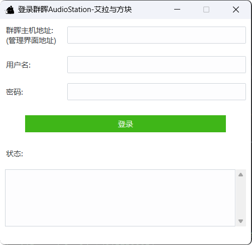
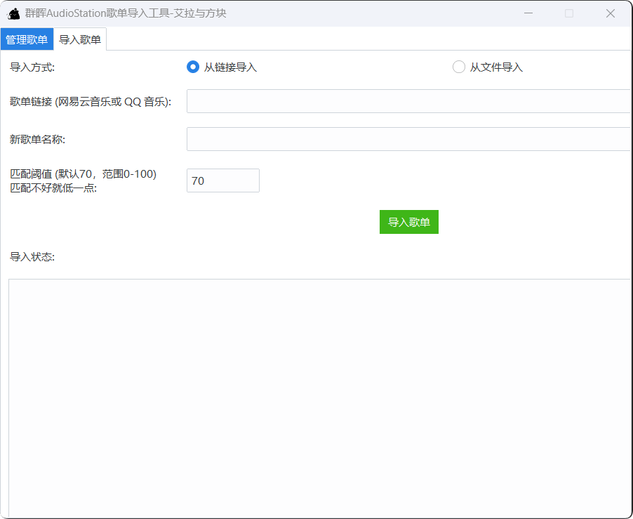

# TNOS AudioStation Playlist Importer

 <!-- 请确保在仓库的 `assets` 文件夹中放置 `logo.png` 或替换为实际图标路径 -->

## 📦项目简介

TNOS AudioStation是一个专为 Synology AudioStation 设计的图形化GUI歌单导入工具。允许用户登录 群晖AudioStation，查看管理歌单列表，支持从网易云音乐或 QQ 音乐导入新的歌单。通过模糊匹配功能，实现匹配并导入 AudioStation 上已有的歌曲。

## 功能概述

- **登录管理**：登录到 Synology AudioStation，获取并缓存服务器中的所有歌曲。
- **歌单管理**：查看、删除 AudioStation 中的当前歌单。
- **歌单导入**：支持从网易云音乐或 QQ 音乐的链接导入歌单，或从本地 `.txt` 文件导入歌单。
- **模糊匹配**：支持通过匹配阈值设置，以一定的容错率匹配并导入歌曲。

## 截图


*登录界面*


*主界面*


*主界面2*

## 环境依赖

本工具基于 Python 3 开发，使用了以下依赖库：

- [`ttkbootstrap`](https://github.com/israel-dryer/ttkbootstrap)：用于创建现代化的图形界面。
- [`requests`](https://docs.python-requests.org/en/latest/)：用于发送 HTTP 请求。
- [`fuzzywuzzy`](https://github.com/seatgeek/fuzzywuzzy)：用于模糊匹配歌曲。
- [`tqdm`](https://github.com/tqdm/tqdm)：用于显示命令行进度条。
- [`python-Levenshtein`](https://github.com/ztane/python-Levenshtein)：提高 `fuzzywuzzy` 的性能。
- [`ttk`](https://docs.python.org/3/library/tkinter.ttk.html)：用于构建图形用户界面。
- [`有可能缺失标注，缺少的请自行补全`]

### 安装依赖

1. **克隆仓库**

    ```bash
    git clone https://github.com/Aftnos/TNOSaudiostation.git
    cd TNOSaudiostation
    ```

2. **创建并激活虚拟环境**（推荐）

    ```bash
    python -m venv venv
    # Windows
    venv\Scripts\activate
    # macOS/Linux
    source venv/bin/activate
    ```

3. **安装依赖项**

    ```bash
    pip install 上面提到的依赖库
    ```
    
##🚀使用说明

### 1. 启动工具

在终端或命令提示符中运行以下命令启动工具：

```bash
python GUIOK.py
```

### 2. 登录 Synology AudioStation

启动工具后，会显示登录窗口。请输入以下信息：

- **Synology 主机地址**：输入 Synology AudioStation 服务器的地址，例如 `http://192.168.1.100:5000`。
- **用户名**：用于登录 AudioStation 的用户名。
- **密码**：用于登录 AudioStation 的密码。

点击“登录”按钮后，工具会尝试连接到 AudioStation 并缓存所有歌曲。登录成功后，将进入主界面。

### 3. 歌单管理功能

在主界面中，选择“管理歌单”标签页可以查看和管理当前的 AudioStation 歌单列表：

- **查看歌单**：所有当前的 AudioStation 歌单将列在表格中，显示歌单名称。
- **删除歌单**：选中一个歌单后，点击“删除选中的歌单”按钮以删除该歌单。

### 4. 歌单导入功能

切换到“导入歌单”标签页，可以将网易云音乐或 QQ 音乐的歌单导入到 AudioStation：

#### 导入方式

- **从链接导入**：
    - 选择“从链接导入”单选按钮。
    - 在输入框中粘贴网易云音乐或 QQ 音乐的歌单链接。
    - 输入导入到 AudioStation 的新歌单名称。
    - 设置匹配阈值（默认为70分，范围0-100）。
    - 点击“导入歌单”按钮开始导入。

- **从文件导入**：
    - 选择“从文件导入”单选按钮。
    - 点击“选择歌单文件 (txt)”按钮，选择本地的 `.txt` 文件。文件每行应为 `"歌曲名 - 艺术家名"` 格式。
    - 输入导入到 AudioStation 的新歌单名称。
    - 设置匹配阈值（默认为70分，范围0-100）。
    - 点击“导入歌单”按钮开始导入。

#### `.txt` 文件格式规范

导入的 `.txt` 文件应满足以下格式要求：

- 每行包含一首歌曲的信息，格式为 `"歌曲名 - 歌手"`。
- 虽然做了倒置即能接受格式为 `"歌手 - 歌曲名"`但是还是建议歌曲名在前。
- 示例：

    ```plaintext
    花海 - 周杰伦
    晴天 - 周杰伦
    无名的人 - 毛不易
    等等
    ```

- **注意**：
    - 歌曲名和歌手名之间使用 `-` 分隔。
    -  `-` 和歌手和歌曲名连接中间有空格。

### 5. 匹配阈值说明

匹配阈值决定了歌曲匹配的严格程度：

- **高阈值（如80-100）**：匹配更严格，只有高度相似的歌曲才会被匹配成功。
- **低阈值（如50-70）**：匹配更宽松，容许一定的差异，匹配更多的歌曲。

根据您的需求调整匹配阈值，以达到最佳的匹配效果。

## 计划

后续将更新自动下载没有的歌曲到群晖中（不设固定接口，网络获取，免责声明）

## 贡献

欢迎通过提交 Issue 或 Pull Request 来贡献代码和改进建议。如果您在使用过程中遇到问题或有功能需求，请在 [GitHub Issues](https://github.com/Aftnos/TNOSaudiostation/issues) 中提出。

## 许可证

本项目基于 GPL-3.0 许可证开源，详情见 [LICENSE](https://github.com/Aftnos/TNOSaudiostation/blob/main/LICENSE)。

## 联系方式

如果您有任何问题或建议，请联系 [Aftnos](https://github.com/Aftnos)。

## 其他信息

---
